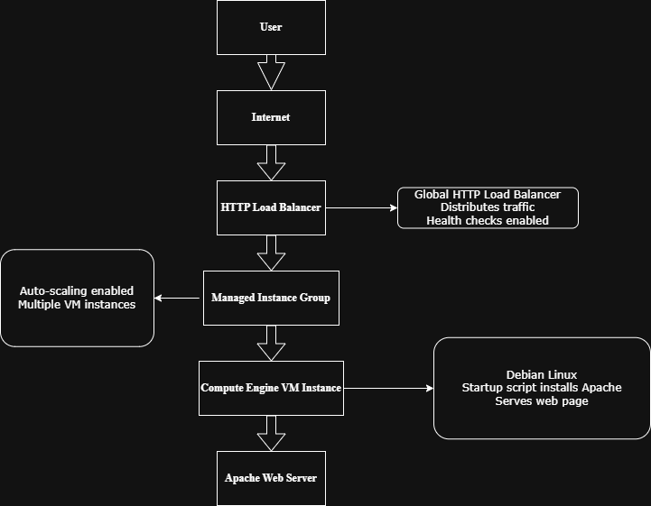
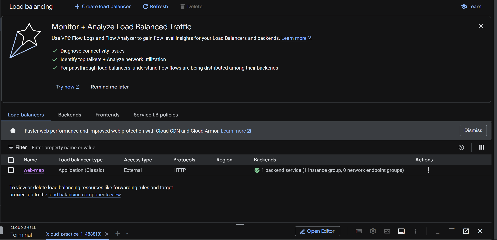
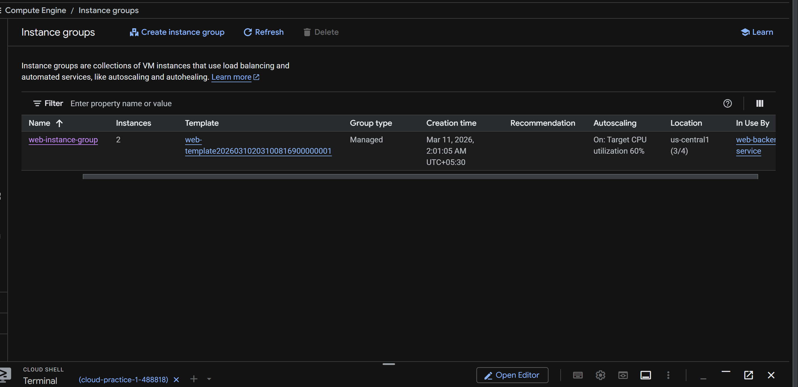
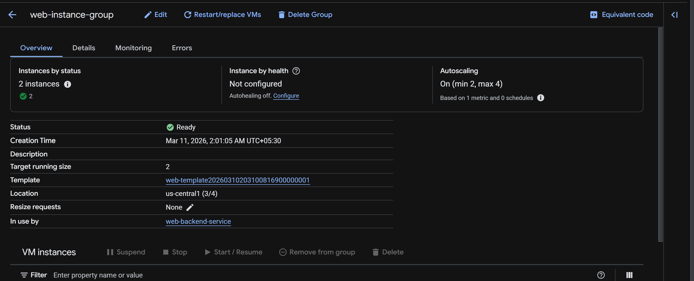
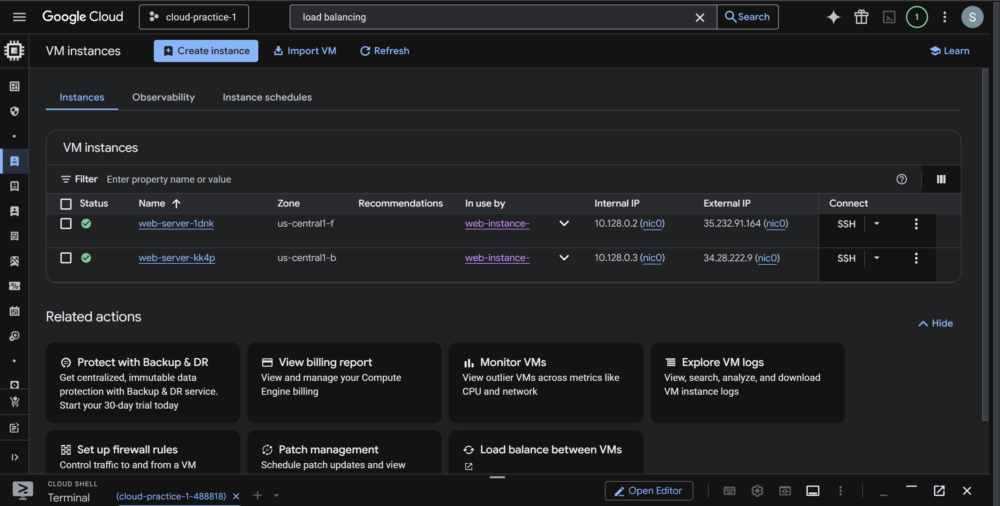
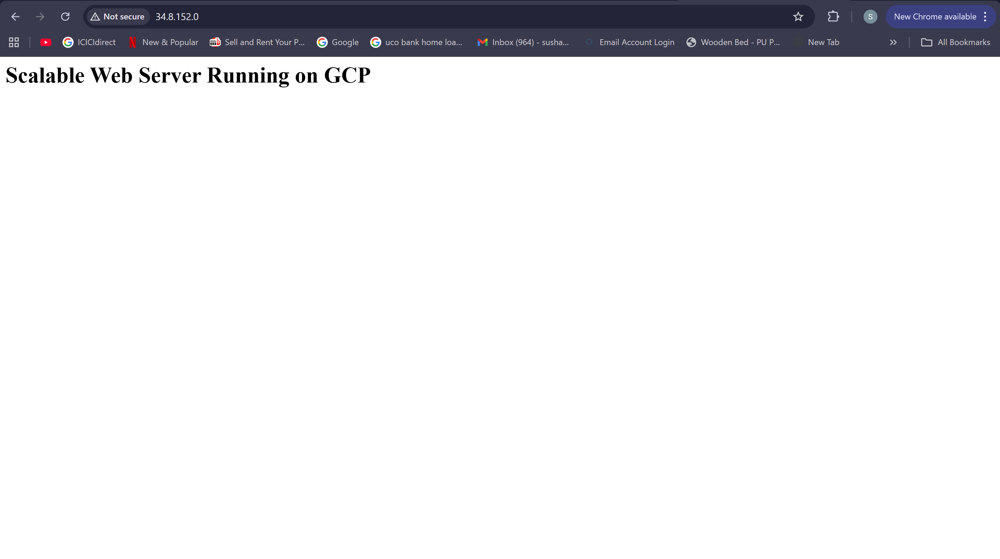
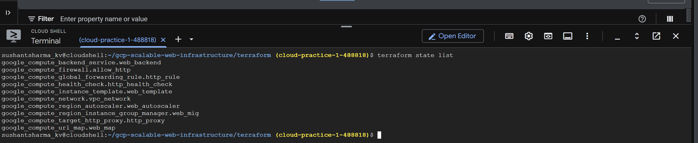

# Scalable Web Infrastructure on Google Cloud using Terraform

## Project Overview

This project demonstrates the deployment of a scalable and highly available web infrastructure on Google Cloud Platform using Terraform.

The infrastructure provisions a web server environment that automatically scales based on demand and distributes incoming traffic using a load balancer.

This project showcases Infrastructure as Code (IaC) practices and core cloud architecture components used in modern production environments.

---

## Architecture

The infrastructure consists of the following components:

- HTTP Load Balancer to distribute incoming traffic
- Managed Instance Group to manage multiple VM instances
- Compute Engine instances running a web server
- Auto-scaling configuration to adjust capacity automatically
- Custom startup script to install and configure Apache

Architecture Diagram:

---

## Technologies Used

- Google Cloud Platform
- Terraform
- Compute Engine
- Managed Instance Groups
- HTTP Load Balancer
- Apache Web Server
- Linux (Debian)

---

## Infrastructure Components

### Virtual Machine Instances
Compute Engine instances are created using an Instance Template and deployed within a Managed Instance Group.

### Managed Instance Group
Automatically manages multiple VM instances and ensures high availability.

### Auto Scaling
Automatically increases or decreases the number of instances depending on system load.

### HTTP Load Balancer
Distributes incoming web traffic across multiple backend instances to ensure reliability and performance.

### Startup Script
A custom startup script installs and configures Apache on each VM instance.

---

## Deployment with Terraform

The infrastructure is fully provisioned using Terraform.

Terraform configuration files define:

- Compute Engine resources
- Load balancer configuration
- Instance templates
- Managed instance groups
- Autoscaling policies

Terraform enables reproducible infrastructure deployments using Infrastructure as Code principles.

---

## Screenshots

### Load Balancer Configuration

### Instance Group

### Autoscaling Configuration

### VM Instances

### Web Server Running

### Terraform Resources

---

## Skills Demonstrated

- Cloud Infrastructure Design
- Infrastructure as Code with Terraform
- Load Balancing Architecture
- Auto Scaling Systems
- Cloud Networking
- Linux Server Configuration
- Cloud Deployment Automation

---

## Author

Sushant Sharma
