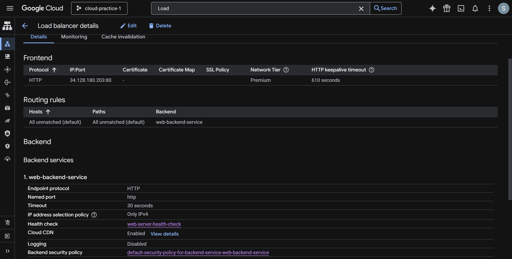
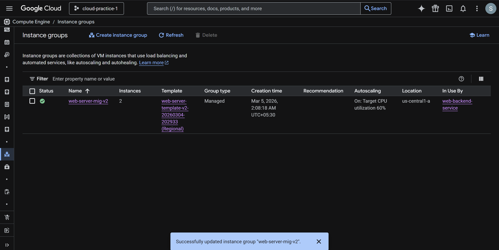
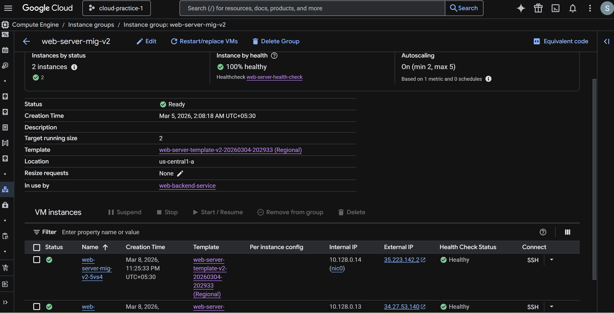
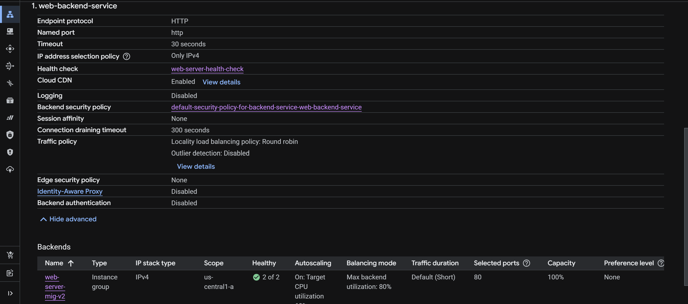
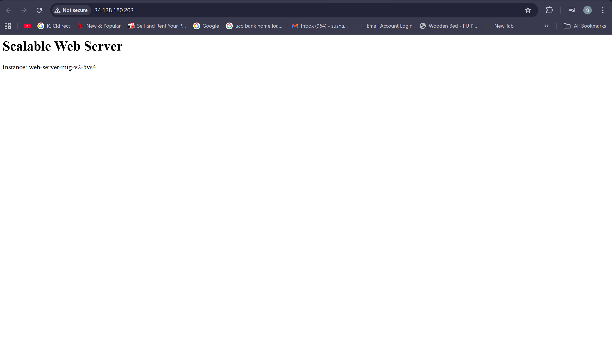
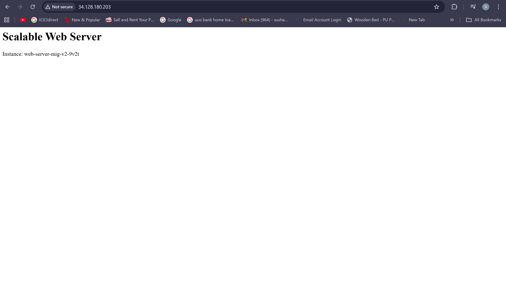

# GCP Scalable Web Infrastructure

This project demonstrates how to deploy a highly available and scalable web infrastructure on Google Cloud Platform (GCP) using a Load Balancer, Managed Instance Groups, and Autoscaling.

The setup automatically distributes traffic across multiple VM instances and scales based on demand.

---

## Architecture Overview

This architecture includes:

- Google Cloud Load Balancer to distribute traffic
- Managed Instance Group (MIG) for scalable VM instances
- Autoscaling based on CPU utilization
- Startup script to automatically configure the web server
- Health checks to ensure instance reliability

User Request → Load Balancer → Managed Instance Group → VM Instances (Apache Web Server)

---

## Technologies Used

- Google Cloud Platform (GCP)
- Compute Engine
- Managed Instance Groups
- HTTP Load Balancer
- Autoscaling
- Apache Web Server
- Bash Startup Scripts

---

## Project Setup Steps

### 1. Create Instance Template

An instance template was created to define the VM configuration.

Key configuration:
- Machine type: e2-micro
- Boot disk: Debian
- Startup script installs Apache web server

---

### 2. Configure Startup Script

The startup script automatically installs Apache and starts the web server.
# GCP Scalable Web Infrastructure

This project demonstrates how to deploy a highly available and scalable web infrastructure on Google Cloud Platform (GCP) using a Load Balancer, Managed Instance Groups, and Autoscaling.

The setup automatically distributes traffic across multiple VM instances and scales based on demand.

---

## Architecture Overview

This architecture includes:

- Google Cloud Load Balancer to distribute traffic
- Managed Instance Group (MIG) for scalable VM instances
- Autoscaling based on CPU utilization
- Startup script to automatically configure the web server
- Health checks to ensure instance reliability

User Request → Load Balancer → Managed Instance Group → VM Instances (Apache Web Server)

---

## Technologies Used

- Google Cloud Platform (GCP)
- Compute Engine
- Managed Instance Groups
- HTTP Load Balancer
- Autoscaling
- Apache Web Server
- Bash Startup Scripts

---

## Project Setup Steps

### 1. Create Instance Template

An instance template was created to define the VM configuration.

Key configuration:
- Machine type: e2-micro
- Boot disk: Debian
- Startup script installs Apache web server

---

### 2. Configure Startup Script

The startup script automatically installs Apache and starts the web server.
#!/bin/bash
apt update
apt install apache2 -y
systemctl start apache2
systemctl enable apache2

echo "<h1>Scalable Web Server Running on GCP</h1>" > /var/www/html/index.html

---

### 3. Create Managed Instance Group

A Managed Instance Group (MIG) was created using the instance template.

Features:
- Multiple VM instances
- Automatic scaling
- Health checks

---

### 4. Configure Autoscaling

Autoscaling was enabled with:

- Minimum instances: 2
- Maximum instances: 5
- Target CPU utilization: 60%

This ensures the infrastructure scales during traffic spikes.

---

### 5. Configure HTTP Load Balancer

An external HTTP Load Balancer was configured to:

- Distribute traffic across VM instances
- Perform health checks
- Ensure high availability

---

## Screenshots

### Load Balancer Configuration

### Instance Group Overview

### Instance Group Details

### Backend Service Configuration

### Web Server Running

---

## Architecture Diagram

     ## Architecture Diagram

        Internet Users
               │
               ▼
       HTTP Load Balancer
               │
               ▼
      Managed Instance Group
        │               │
        ▼               ▼
    VM Instance 1   VM Instance 2
        │               │
        ▼               ▼
      Apache Web Server

## Results

- Web servers deployed automatically using startup scripts
- Traffic distributed across multiple instances
- Infrastructure automatically scales with demand
- High availability ensured through load balancing and health checks

---
## Project Goal

The goal of this project was to design and deploy a scalable and highly available web infrastructure on Google Cloud using load balancing and autoscaling.

This project demonstrates how production systems handle traffic distribution and automatic scaling using Google Cloud services.

## Future Improvements

- Add HTTPS Load Balancer
- Implement Infrastructure as Code using Terraform
- Add monitoring with Cloud Monitoring
- Add CI/CD deployment pipeline

---

## Author

Built as part of a Cloud Engineering / DevOps portfolio project.
